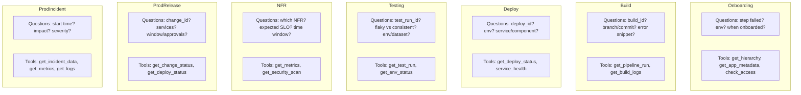
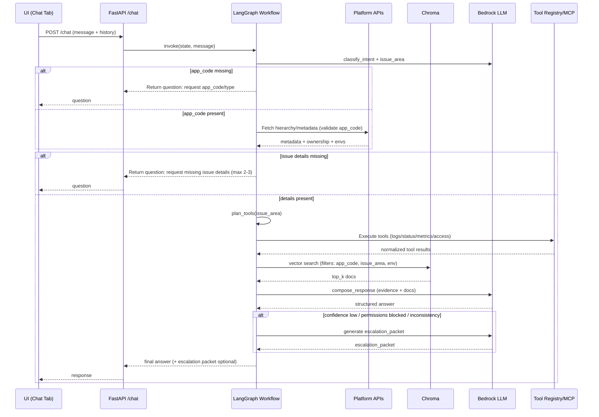

# Support AI Service – Mermaid Diagrams

This file contains Mermaid diagrams for the self-service workflow.

---

## 1) End-to-End LangGraph Workflow (Flowchart)

```mermaid
flowchart TD
  U[User / UI: Ask Help] -->|POST /chat (message + history)| API[FastAPI /chat]
  API --> LG[LangGraph Workflow]

  subgraph LGW[LangGraph Nodes]
    SR[start_or_resume]
    CI[classify_intent]
    EA[ensure_app_context]
    FM[fetch_metadata]
    CID[collect_issue_details]
    PT[plan_tools]
    ET[execute_tools]
    AR[analyze_results]
    RK[retrieve_knowledge (Chroma)]
    CR[compose_response]
    EN[escalate_if_needed]
  end

  LG --> SR --> CI --> EA
  EA -->|missing app_code/type| Q1[Ask user for appCode/type]
  Q1 --> API

  EA --> FM --> CID
  CID -->|missing details| Q2[Ask 2-3 issue questions]
  Q2 --> API

  CID --> PT --> ET --> AR --> RK --> CR --> API

  CR -->|low confidence / inconsistency / perms blocked| EN --> API

  %% External systems
  FM --> META[Platform Metadata APIs]
  ET --> TOOLS[API Tool Registry / Optional MCP]
  RK --> VS[Chroma Vector Store]
  CI --> LLM1[Bedrock LLM]
  CR --> LLM2[Bedrock LLM]
  EN --> LLM3[Bedrock LLM]
```

---

## 2) Issue Flow Subgraph (Decision + Slot Filling)

```mermaid
flowchart LR
  A[Intent = issue] --> B{Have app_code?}
  B -- No --> B1[Ask: BA/System/Component appCode] --> B
  B -- Yes --> C[Fetch BA/System/Component metadata]

  C --> D{Have issue_area?}
  D -- No --> D1[Ask single disambiguation: onboarding/build/deploy/testing/NFR/prod release/prod incident] --> D
  D -- Yes --> E[Collect 2-3 issue_area-specific details]

  E --> F[Plan tools for issue_area]
  F --> G[Execute tools + normalize]
  G --> H[Retrieve docs from Chroma (filtered)]
  H --> I[Compose response: Checked/Found/Actions/Refs]
  I --> J{Escalate?}
  J -- Yes --> K[Generate escalation packet]
  J -- No --> L[Return final answer]
  K --> L
```

---

## 3) Issue Area → Tools (Quick View)



---

## 4) Sequence Diagram (Typical Issue)



---

# End of Mermaid Diagrams
